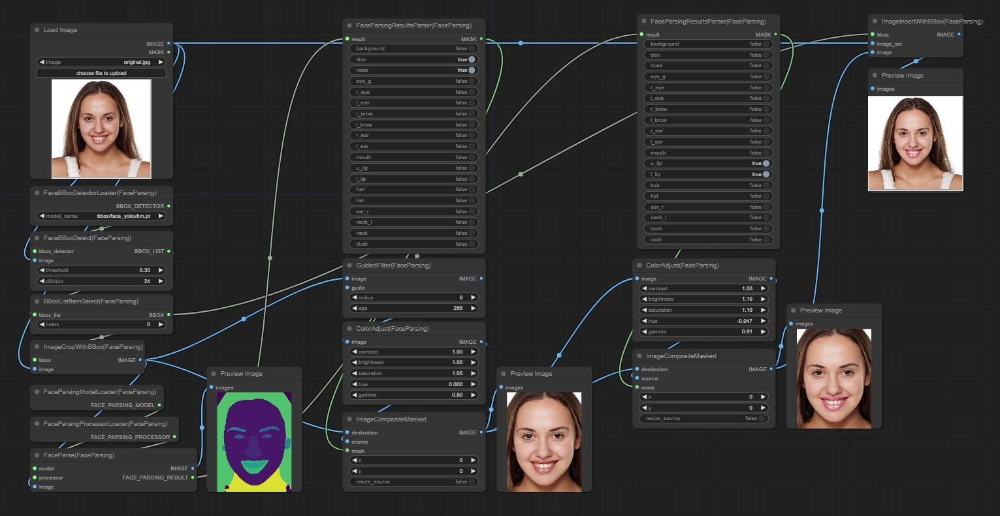

# Introduction
This is a set of custom nodes for [ComfyUI](https://github.com/comfyanonymous/ComfyUI). 
The nodes utilize the [face parsing model](https://huggingface.co/jonathandinu/face-parsing) to parse face and provide detailed segmantation. To improve face segmantation accuracy, [yolov8 face model](https://huggingface.co/Bingsu/adetailer/) is used to first extract face from an image.

There are also auxiliary nodes for image and mask processing. A guided filter is also provided for skin smoothing. 

If you encounter any problems, feel free to open an issue. I'll try to fix it when I'm not busy. Besides, if you like the nodes, please give a star, thanks!

# Installation
Just clone the repo https://github.com/Ryuukeisyou/comfyui_face_parsing.git into ComfyUI's "custom_nodes" directory.

On first run, some required files will be downloaded to ComfyUI's "models/face_parsing/" folder and "models/ultralytics/bbox" folder. If you have difficulty connecting to [Huggingface](https://huggingface.co/), you can try mannually:

1. Download the .json and .safetensors files from the [face parsing model](https://huggingface.co/jonathandinu/face-parsing) repo and save them to the "models/face_parsing/" folder.
2. Download the face_yolov8m.pt from the [Bingsu/adetailer](https://huggingface.co/Bingsu/adetailer/) repo and save it to "models/ultralytics/bbox" folder.

# Requirements
See requirements.txt. Specially, opencv-contrib-python is needed for guided filter. If you have other versions of opencv e.g. opencv-python-headless installed after open-contrib-python, you may need to uninstall opencv-contrib-python and reinstall it again. Note: If you don't need guided filter, you can just forget about opencv-contrib-python, as it is often conflicted by other opencv versions.

# Workflow
a demo work flow is shown below.

<table>
<tr>
<th>Original</th>
<th>Processed</th>
</tr>

<!-- Line 1: Compare -->
<tr>
<td></td>
<td></td>
</tr>
</table>

The image bellow contains the workflow which can be loaded into ComfyUI.

