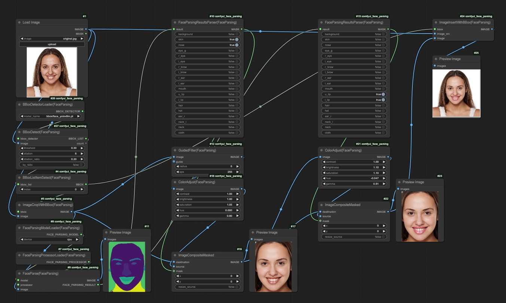

# Introduction
This is a set of custom nodes for [ComfyUI](https://github.com/comfyanonymous/ComfyUI). 
The nodes utilize the [face parsing model](https://huggingface.co/jonathandinu/face-parsing) to provide detailed segmantation of face. To improve face segmantation accuracy, [yolov8 face model](https://huggingface.co/Bingsu/adetailer/) is used to first extract face from an image.

There are also auxiliary nodes for image and mask processing. A guided filter is also provided for skin smoothing. 

# Installation
Just clone the repo https://github.com/Ryuukeisyou/comfyui_face_parsing.git into ComfyUI's "custom_nodes" directory.

On first run, some required files will be downloaded to ComfyUI's "models/face_parsing/" folder. If you have difficulty connecting to [Huggingface](https://huggingface.co/), you can try mannually download the .json and .safetensors files from the [face parsing model](https://huggingface.co/jonathandinu/face-parsing) repo and save them to the "models/face_parsing/" folder.

# Requirements
See requirements.txt. Specially, opencv-contrib-python is needed for guided filter. If you have other versions of opencv e.g. opencv-python-headless installed after open-contrib-python, you may need to uninstall opencv-contrib-python and reinstall it again.

# Workflow
a demo work flow is shown below.

<table>
<tr>
<th>Original</th>
<th>Processed</th>
</tr>

<!-- Line 1: Compare -->
<tr>
<td></td>
<td></td>
</tr>
</table>

This image contains the workflow which can be loaded into ComfyUI.

