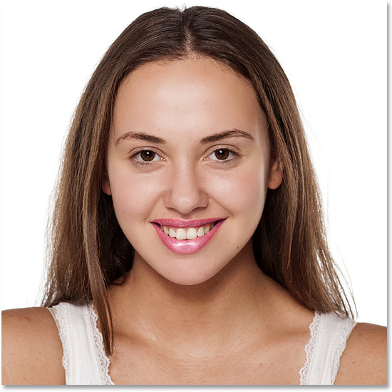

# Introduction
This is a set of custom nodes for [ComfyUI](https://github.com/comfyanonymous/ComfyUI). 
The nodes utilize the [face parsing model](https://huggingface.co/jonathandinu/face-parsing) to provide detailed segmantation of face. To improve face segmantation accuracy, [yolov8 face model](https://huggingface.co/Bingsu/adetailer/) is used to first extract face from an image.

There are also auxiliary nodes for image and mask processing. A guided filter is also provided for skin smoothing. 

# Workflow
a demo work flow is shown below.

<table>
<tr>
<th>Original</th>
<th>Processed</th>
</tr>

<!-- Line 1: Compare -->
<tr>
<td></td>
<td></td>
</tr>
</table>

This image contains the workflow which can be loaded into ComfyUI.

